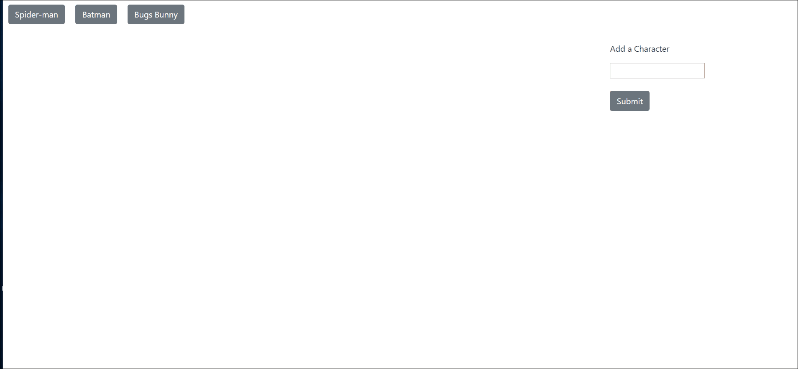
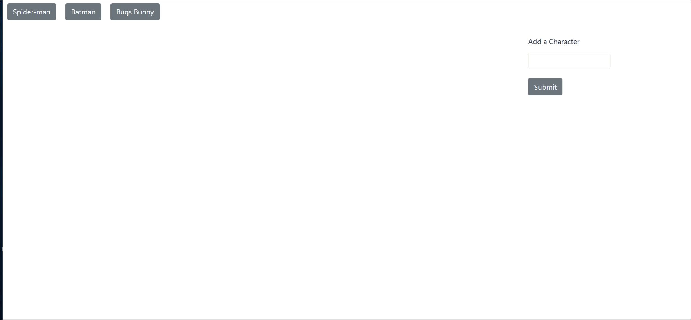

# GifTastic
This webpage utilizes the Giphy API to generate gifs for different fictional characters. 

## How to run the site on local machine
The repository can be cloned by clicking the Clone or Download button on the main repository page, then clicking the button next to the url which appears below. Then open a Terminal or Git Bash window, navigate to the location where you want to place the cloned repository, then type 'git clone' and then paste the repository that was just copied. The site can then be opened by clicking on the index.html file and opening it in a web browser.

## Repository organization
The main directory file contains the 'index.html' file, Readme.md file, the 'css' folder and the 'javascript' folder. The 'css' folder contains the style.css file, with determines how the html elements in the index.html file are styled, as well as reset.css, which contains code to ensure that the styling of the html elements appears consistent across different web browsers. Within the 'javascript' folder is gif.js, which contains code that determines the logic of the site what happens in response to the user's behavior, including adding new character buttons, making an ajax get request from the Giphy API and returnng 10 images of the character, and changing the state of the image from still picture to moving gif and back. Index.html contains all the html code for the site, as well as links to style.css, reset.css, game.js, and to the jQuery and CSS boostrap CDNs. There are also links to files in the images folder to display the images onscreen.

## How to use
Users input the name of new characters into the text box. Javascript code then creates a new button which contains the name of this character and places it to the right of the other character buttons. Clicking on any of these buttons will start another function which uses the character's name as a keyword to retrieve a series of gifs related to this character from the Giphy API and place them in a div on the page. Each gif has a rating, which is placed above gif in the div. The limit parameter is placed in the url for this function so that only 10 results are retrieved. Whenever a new character button is clicked, the div containing the gifs is emptied, if it contains any gifs, and 10 gifs from the new character populate the div. Initially, a still image version of the gif is displayed. Clicking on each gif will call another function which replaces the still image with an animated gif. Clicking on the animated gif will likewise replace it with the still image once again. 
  

  

  

  

## Technology used
* HTML
* CSS
* CSS Bootstrap
* JavaScript
* jQuery
* AJAX
* APIs:
  * Giphy

## Link to deployed Github site 
https://pkeane2018.github.io/GifTastic/
